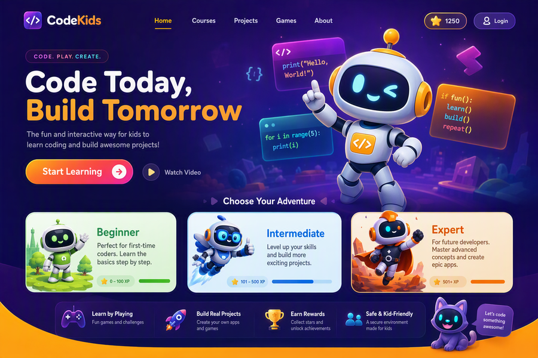
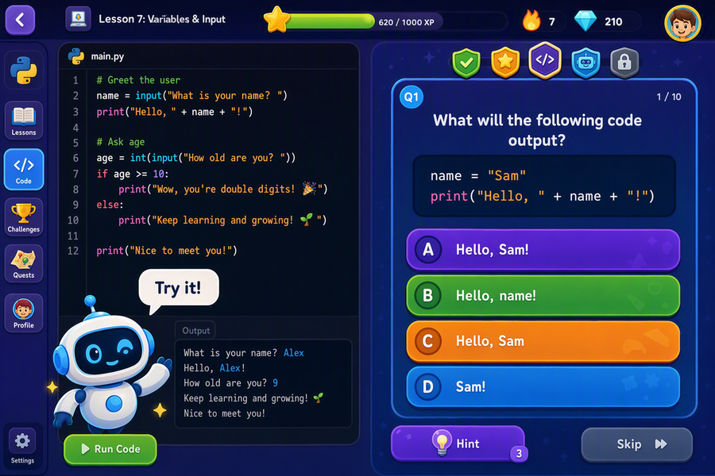
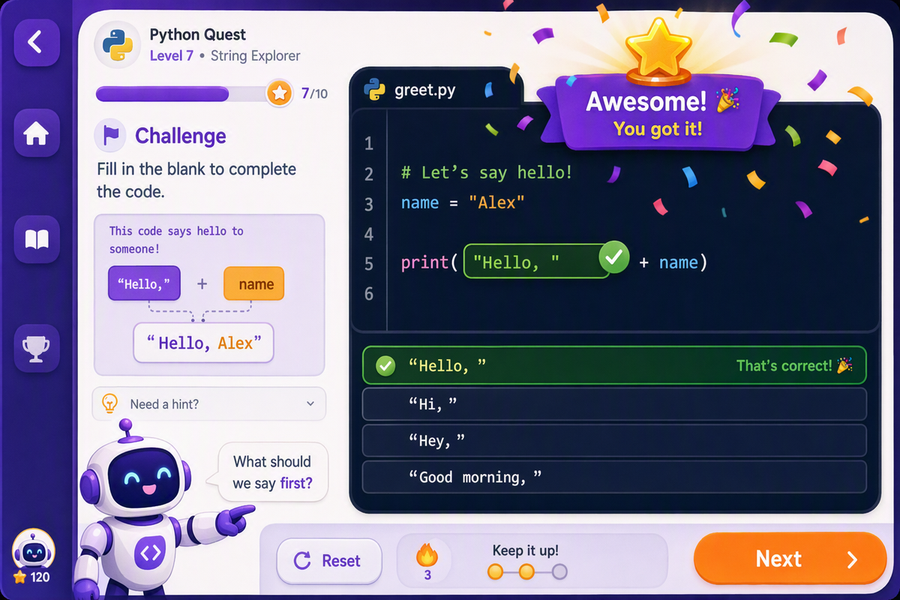
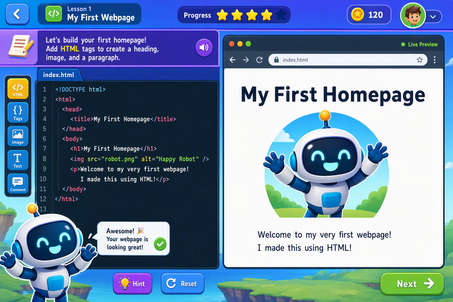
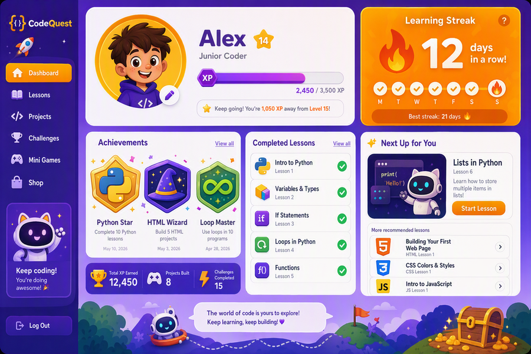
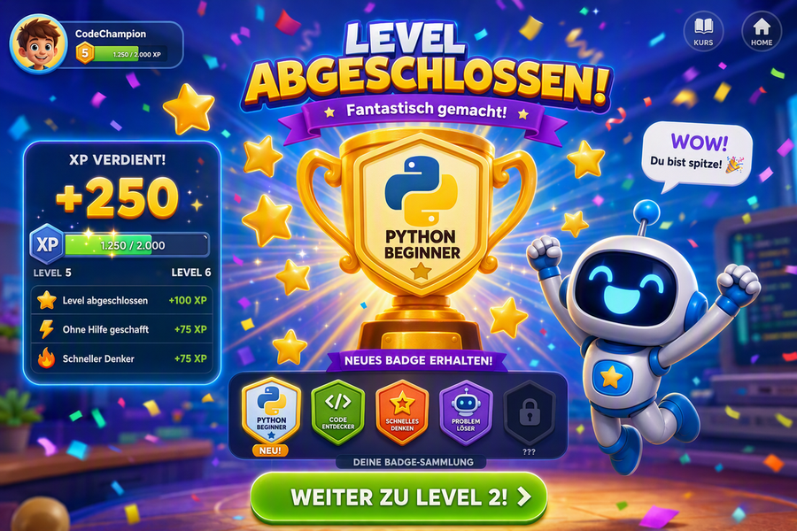
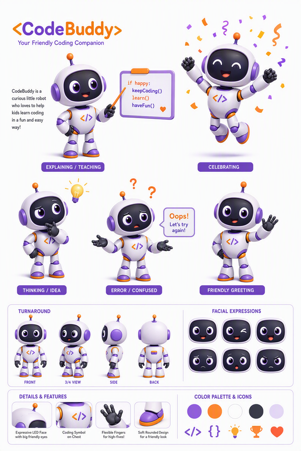

# KidsCode Platform

KidsCode ist eine interaktive Web-Lernplattform für Kinder ab etwa 5 bis 6 Jahren. Das MVP vermittelt Programmiergrundlagen spielerisch über kurze Lektionen, direkte Übungen, XP, Badges, Streaks und einen lokalen Profilmodus ohne Login.

## MVP-Status

Version `v0.1.0-mvp` umfasst:

- 4 Kurse über 3 Level: Beginner Python, Beginner HTML, Intermediate Programmierwerkstatt, Expert Tech-Lab
- 16 Lektionen mit didaktischen Texten aus dem KidsCode-Konzept
- 64 Übungen: Multiple Choice, Code-Lücken und freie Code-Aufgaben
- Profil ohne Authentifizierung über `localStorage` plus SQLite/Prisma
- XP, Streaks, Badge-Vergabe, Level-Up-Hinweis und Leaderboard
- Python-Ausführung im Browser über lazy-loaded Pyodide
- HTML/CSS/JavaScript-Preview über sandboxed iframe

## Screenshots















## Tech Stack

- Next.js 14 App Router mit TypeScript strict
- Tailwind CSS und shadcn/ui-kompatible UI-Primitives
- Prisma 7 mit SQLite über `better-sqlite3`
- CodeMirror 6 für Python- und HTML-Editoren
- Pyodide für Python-Ausführung im Browser, lazy-loaded erst bei Python-Code-Übungen
- Framer Motion für Karten, Feedback, Konfetti, XP-Animationen und Maskottchen-Idle-State
- `localStorage` für die einfache Profilbindung im Browser

## Setup

```bash
npm install
npx prisma generate
npx prisma db push
npm run db:seed
npm run dev
```

Danach läuft die App standardmäßig unter `http://localhost:3000`.

## Qualität prüfen

```bash
npm run typecheck
npm run lint
npm run build
```

Der Seed ist idempotent und kann mehrfach ausgeführt werden:

```bash
npm run db:seed
```

## Projektstruktur

```text
src/app/
  api/profile/              Profil-API und Dashboard-Daten
  api/progress/             Übungsvalidierung, XP, Streaks, Badges
  courses/[level]/          Kurs-, Lektions- und Übungsseiten
  leaderboard/              Top-10 nach XP
  profile/                  Profilanlage und Dashboard
src/components/
  editor/                   CodeMirror-Komponente
  layout/                   Header, Footer, Theme Toggle
  lessons/                  Theorie- und Übungsviews
  mascot/                   Animierter SVG-Roboter
  ui/                       UI-Bausteine
src/lib/
  gamification.ts           Badge-, Streak- und Level-Up-Regeln
  lesson-queries.ts         Kursdaten-Aufbereitung und Starter-Code
  prisma.ts                 Prisma Client
prisma/
  schema.prisma             Datenmodell
  seed.ts                   Vollständiger MVP-Kurskatalog
```

## Kursinhalte

Beginner Python:

- Hallo Welt in Python
- Variablen sind Boxen
- Rechnen mit Python
- Entscheidungen mit `if`
- Fehler finden

Beginner HTML:

- HTML-Bausteine
- Text und Links
- Listen bauen

Intermediate Programmierwerkstatt:

- Schleifen wiederholen Arbeit
- Funktionen sind Zauberkisten
- Listen speichern viele Dinge
- CSS macht Webseiten bunt
- JavaScript macht Seiten lebendig

Expert Tech-Lab:

- C-Intro: nah am Computer
- OOP in Python: eigene Baupläne
- Mini-Projekt: Idee planen und bauen

## Entwicklungs-Roadmap

1. Authentifizierung und Eltern-/Lehrerbereich ergänzen.
2. Produktionsdatenbank, Migrationen und Deployment-Pipeline einrichten.
3. Robusteres Assessment für freie Code-Aufgaben bauen, statt nur erwartete Ausgabe oder Code-Substring zu prüfen.
4. Redaktionelles Content-Review mit Altersfreigabe, Barrierefreiheit und Mehrsprachigkeit durchführen.
5. E2E-Testabdeckung für Profilanlage, Kursabschluss, Badge-Vergabe und Pyodide-Laufzeit ergänzen.
6. Admin-Tooling für neue Kurse, Lektionen und Übungen entwickeln.
